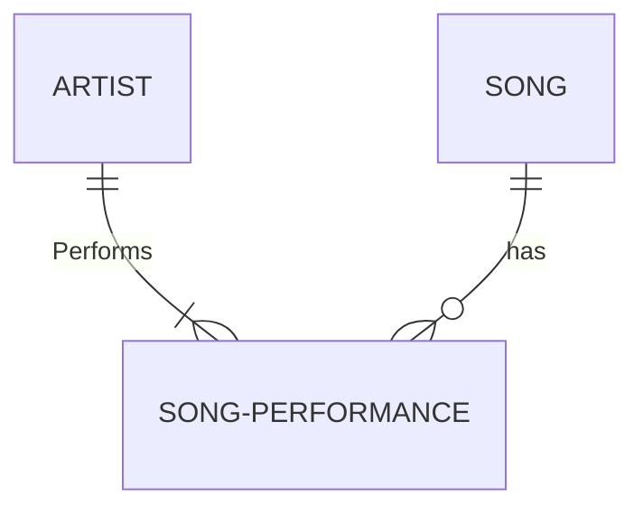

# Part 1: Model a concert database model using an Entity-Relation (ER) diagram

1. Install the "Mermaid Preview" VS Code extension that is needed to render Mermaid ER diagrams in a markdown file
2. Create a new markdown file in Visual Studio Code
3. Here is an example that shows a typical Mermaid ER diagram:

```Code


The Mermaid "code" above generates the following ER diagram:


You can find an online example of an ER diagram in Mermaid [here](https://mermaid.live/edit#pako:eNp10d1qwyAUB_BXkXPd9AFyV6KMwLoMkxYK3jg9W2VJLM4URsy7zyyRrR3zzsPv_I8fIyirEXJAR418c7ITPYmrONRNtWecTGG7DSOh7LE8Mn7KdpRyVtckJ2f5cWdDyDI7korTuMnJpZUK_zHl07EqCxaVgNbIlxbJq3UCFv1n2l2yQ4XmmrJT1ozCD1L2im4lS-03yMqG7aMyvWoHnaKeeUUPRZMVu4Y9VPyUWtb6d2rvpelv_c35UrIA6zQ61HGGANhAh66TRsfHHuduAf6MHQqYqZbufb79FJ0cvK0_ewW5dwNuYLho6XH9nqU4fQEQvIY9)

The content in these entities/tables could look like something like this:

Artist table
| ArtistId (primary key) | Artist name | Birth date |
|-|-|-|
| A1 | Taylor Swift | 1989-12-13 |
| A2 | Miley Cyrus | 1992-11-23 |

Song table
| SongId (primary key) | Title |
|-|-|
| S1 | Shake If off |
| S2 | Flowers |

Song-performance table
| SongPerformanceId | ArtistId (foreign key) | SongId (foreign key) | Length (minutes and seconds) |
|-|-|-|-|
| SP1 | A1 | S1 | 03:39 |
| SP2 | A1 | S2 | 03:15 |
| SP3 | A2 | S1 | 03:48 |
| SP4 | A2 | S2 | 03:29 |

Now we are going to take the concepts of artists and songs a bit further.
We want to make a system that keeps track of artists, songs, concerts and concert venues.
The system should be able to give us reports on which artists were performing at the different concerts.
For each concert, we also want to know which songs that were performed.
Each song at each concert can be performed by multiple artists, ex. duets.
We also want to know the name of the concert venues and what concerts that have taken place at the different venues.

1. Create ER diagrams in Mermaid for the different entities needed to meet the requirements above
2. Create logical tables for the different entities you have modeled as in the examples above