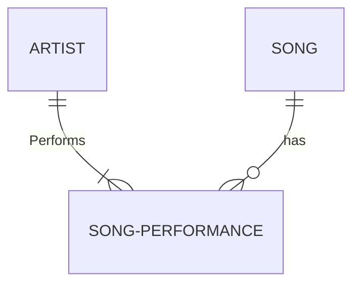

# Part 1: Model a concert database model using Enity-Relation (ER) diagram

1. Create a new markdown file in Visual Studio Code
2. Install the "Mermaid Preview" VS Code extension that is needed to render Mermaid ER diagrams in a markdown file
3. Here is an example that shows a typical Mermaid ER diagram:

The content in these entities/tables could look like something like this:

Artist table
| ArtistId (primary key) | Artist name | Birth date |
|-|-|-|
| A1 | Taylor Swift | 1989-12-13 |
| A2 | Miley Cyrus | 1992-11-23 |

Song table
| SongId (primary key) | Title |
|-|-|
| S1 | Shake If off |
| S2 | Flowers |

Song-performance table
| SongPerformanceId | ArtistId (forreign key) | SongId (forreign key) | Length (minuses and seconds) |
|-|-|-|-|
| SP1 | A1 | S1 | 03:39 |
| SP2 | A1 | S2 | 03:15 |
| SP3 | A2 | S1 | 03:48 |
| SP4 | A2 | S2 | 03:29 |

4. Now we are going to take the concepts of artists and songs a bit further. We want to make a system that keeps track of artists, songs, concerts and concert venues. The system should be able to give use reports on which artists that were performing at the different concerts. For each concert we also want to know which songs that was performed. Each song at each concert can be performed by multiple artists, ex. duets. We also want to know the name of the concert venues and what concerts that have taken place at the different venues.

A. Create ER diagrams in Mermaid for the different entities needed to meet the requrements above
B. Create logical tables for the different entites you have modelled as in the examples above