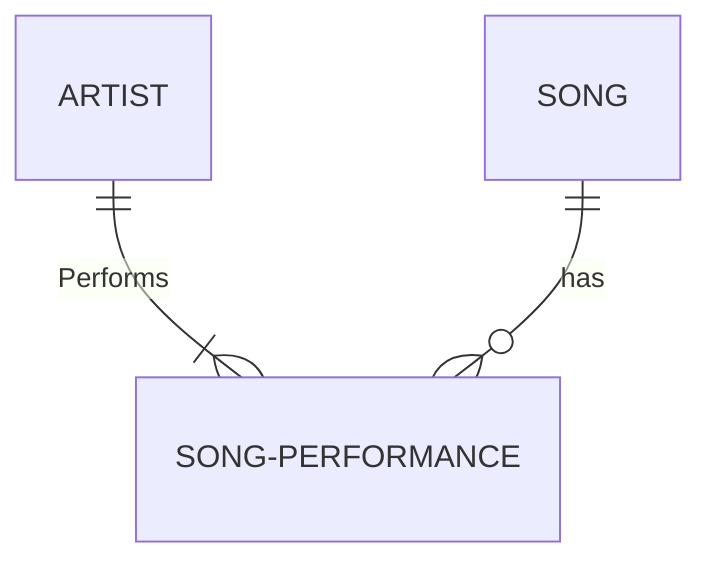
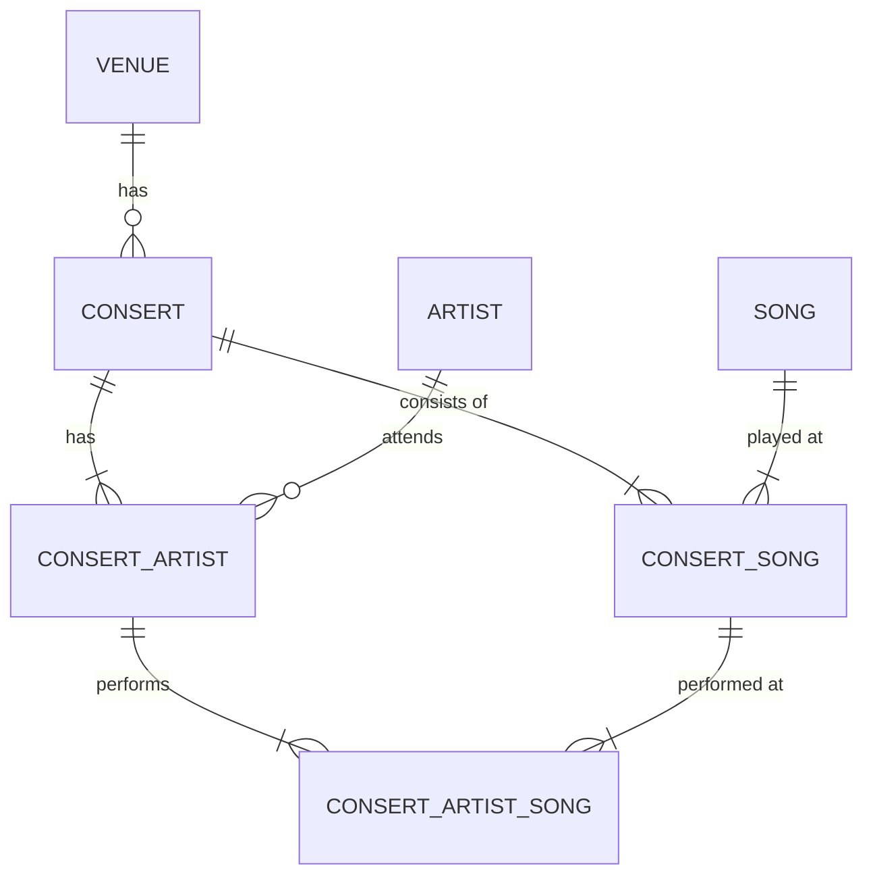

# ErDiagram

Artist
A1 : Taylor Swift
A2 : Miley Cyrus

Song
S1 : Shake If off
S2 : Flowers

Venue
V1: Avicii Arena (Globen)
V2: Telenor Arena

Consert
C1 : "Taylor S. & Miley C. collaberation", V1, 2024-03-24 23:00, 2024-03-25 01:00

Concert_Artist
CA1: C1, A1
CA2: C1, A2

Consert_Song
CS1: C1, S1
CS2: C1, S2

Consert_Song_Consert_Artist
CS1CA1: CS1, CA1
CS1CA2: CS1, CA2
