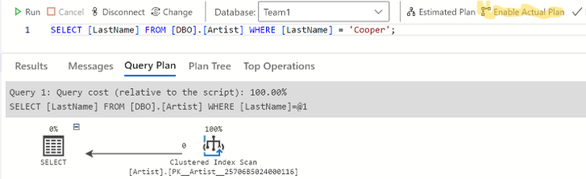

# Part 5: Optimize tables with indexes

Given the following query:

```SQL
SELECT
    v.[Name] AS [VenueName],
    c.[Title] AS [ConcertTitle],
    a.[LastName] AS [ArtistLastName],
    a.[FirstName] AS [ArtistFirstName],
    s.[Title] AS [SongTitle]
FROM
    [DBO].[Venue] v
    JOIN [DBO].[Concert] c
        ON v.[VenueId] = c.[VenueId]
    JOIN [DBO].[Concert_Artist] ca
        ON c.[ConcertId] = ca.[ConcertId]
    JOIN [DBO].[Artist] a
        ON ca.[ArtistId] = a.[ArtistId]
    JOIN [DBO].[Concert_Song] cs
        ON c.[ConcertId] = cs.[ConcertId]
    JOIN [DBO].[Song] s
        ON cs.[SongId] = s.[SongId]
WHERE
    c.Title LIKE 'M%'
ORDER BY
    c.Title;
```

## Create indexes

Using the "Actual plan" in Azure Data Studio, what indexes should we create to optimize the query above?

- How to enable the Actual plan in Azure Data Studio:
  
- Create the missing indexes and run the query again to see if we have any index scans left. Keep in mind that we want to create as few indexes as possible to not degrade the performance for write operations like INSERT, UPDATE & DELETE too much.
- A tip is to create one index at a time and run the query again to see if we have been able to replace one "index scan" with an "index seek". Also, an index can contain multiple columns.

## Compare the same query without and with indexes

Compare the actual execution plan for the same query with the indexes disabled and with the indexes enabled (rebuilt).

- Indexes can be disabled and enabled (rebuilt) using the following syntax:

```SQL
ALTER INDEX [IX_Employee_OrganizationLevel_OrganizationNode] ON [DBO].[Employee] DISABLE;

ALTER INDEX [IX_Employee_OrganizationLevel_OrganizationNode] ON [DBO].[Employee] REBUILD;
```

- Since we rebuild the indexes between the queries we will get some extra actual execution plans in the output.
We should only compare the first and the last actual execution plan to make a valid comparison.

## Tip: A good tutorial on SQL

 [W3Schools SQL - Index](https://www.w3schools.com/sql/sql_create_index.asp)
