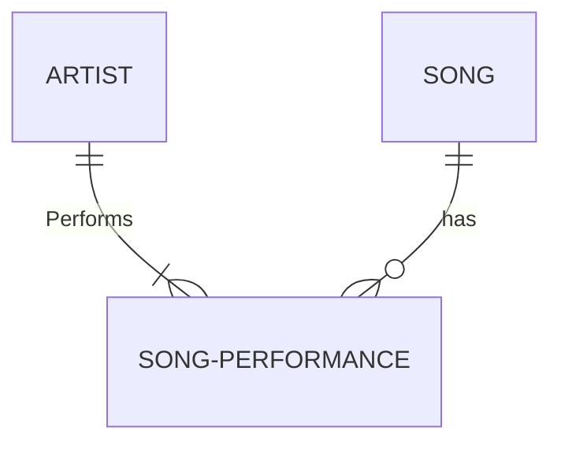

- [Prerequisite](#prerequisite)
- [Intro](#intro)
- [Workshop](#workshop)
  - [Part 1: Model a concert database model using Enity-Relation (ER) diagram](#part-1-model-a-concert-database-model-using-enity-relation-er-diagram)
  - [Part 2: Create tables and queries](#part-2-create-tables-and-queries)
    - [Connect to your team's databse](#connect-to-your-teams-databse)
    - [Create SQL scripts to create the different entites and the relations between them](#create-sql-scripts-to-create-the-different-entites-and-the-relations-between-them)
  - [Part 3: Create SQL scripts to populate the tables with data](#part-3-create-sql-scripts-to-populate-the-tables-with-data)
  - [Part 4: Create SQL queries reports](#part-4-create-sql-queries-reports)
  - [Part 5: Optimize performance with indexes](#part-5-optimize-performance-with-indexes)
    - [Fork the template repo to your personal GitHub](#fork-the-template-repo-to-your-personal-github)
  - [Part 2: Optimize the tables](#part-2-optimize-the-tables)
    - [Clone the repo](#clone-the-repo)
- [For the course instructor](#for-the-course-instructor)
  - [Workshop setup](#workshop-setup)

# Prerequisite

* Azure Data Studio: https://learn.microsoft.com/en-us/azure-data-studio/download-azure-data-studio?tabs=win-install%2Cwin-user-install%2Credhat-install%2Cwindows-uninstall%2Credhat-uninstall
* Access to the OmegaPoint Azure subscription: https://portal.azure.com/#@itverket.no/resource/subscriptions/d6d57ee0-64af-4adc-b5cc-44e24edcdb53/resourceGroups
* Visual Studio Code: https://code.visualstudio.com/ with the following extensions:
  * Mermaid Preview Markdown Support

# Intro

In this workshop we are going to create a database that keep tracks of concerts, artists and songs.
We will first modell the database using Entity-Relation (ER) diagrams in Mermaid. Based on our ER-model
we are going to implement the required database tables and columns. The next step in the workshop is to
use AI to create scripts to populate our database tables with test data. When we have populated the tables
with test data we will make different reports using SQL queries. The next and last part of the workshop
is to optimize our tables for read performance by implementing indexes to our database tables.

Course material for Storage & Databases. This includes workshop guide and instructions for the instructor.

Related files: https://github.com/Omegapoint-Norge-Academy/storage-and-databases/workshop

# Workshop

The workshop consists of the following parts:

1. Model a concert database model using ER-diagrams
2. Create a database & tables needed for the concert system
3. Insert test data into the database tables
4. Create database queries
5. Optimize the tables with indexes

## Part 1: Model a concert database model using Enity-Relation (ER) diagram

1. Create a new markdown file in Visual Studio Code
2. Install the "Mermaid Preview" VS Code extension that is needed to render Mermaid ER diagrams in a markdown file
3. Here is an example that shows a typical Mermaid ER diagram:

The content in these entities/tables could look like something like this:

Artist table
| ArtistId (primary key) | Artist name | Birth date |
|-|-|-|
| A1 | Taylor Swift | 1989-12-13 |
| A2 | Miley Cyrus | 1992-11-23 |

Song table
| SongId (primary key) | Title |
|-|-|
| S1 | Shake If off |
| S2 | Flowers |

Song-performance table
| SongPerformanceId | ArtistId (forreign key) | SongId (forreign key) | Length (minuses and seconds) |
|-|-|-|-|
| SP1 | A1 | S1 | 03:39 |
| SP2 | A1 | S2 | 03:15 |
| SP3 | A2 | S1 | 03:48 |
| SP4 | A2 | S2 | 03:29 |

4. Now we are going to take the concepts of artists and songs a bit further. We want to make a system that keeps track of artists, songs, concerts and concert venues. The system should be able to give use reports on which artists that were performing at the different concerts. For each concert we also want to know which songs that was performed. Each song at each concert can be performed by multiple artists, ex. duets. We also want to know the name of the concert venues and what concerts that have taken place at the different venues.

A. Create ER diagrams in Mermaid for the different entities needed to meet the requrements above
B. Create logical tables for the different entites you have modelled as in the examples above

## Part 2: Create tables and queries

### Connect to your team's databse

1. Ask the course instructor for a connection string to the Azure database you are going to work with
2. Start the "Azure Data Studio" and log on to the database with  using the provided connections string:
   1. Select "New -> New connection"
   2. Select "Connection type" : "Microsoft SQL Server"
   3. Select "Input type" : "Connection String"
   4. Insert the connection string into the "Connection string" text box
   5. Leave the other fields with the default values

### Create SQL scripts to create the different entites and the relations between them

The following tables and columns should be created

Venue:

- VenueId (Integer - Primary key)
- Name (Varchar - Length: 255)

Concert:

- ConcertId (Integer - Primary key)
- Title (Varvhar - Length: 255)
- Description (Varchar - length: 4096 )
- StartTime (DateTime)
- EndTime (DateTime)
- VenueId (Integer - Foreign key)

Artist:

- ArtistId (Integer - Primary key)
- FirstName (Varchar - Length: 255)
- LastName (Varchar - Length: 255)

Song:

- SongId (Integer - Primary key)
- Title (Varchar - Length: 255)

Concert_Artist (link-table):

- ConcertArtistId (Integer - Primary key)
- ConcertId (Integer - Foreign key)
- ArtistId (Integer - Foreign key)

Concert_Song (link-table):

- ConcertSongId (Integer - Primary key)
- ConcertId (Integer - Foreign key)
- SongId (Integer - Foreign key)
- LengthInSeconds (SmallInt) - Length of the song performance in seconds in the concert

Concert_Artist_Song (link-table):

- ConcertArtistSongId (Integer - Primary key)
- ConcertArtistId (Integer - Foreign key)
- ConcertSongId (Integer - Foreign key)

## Part 3: Create SQL scripts to populate the tables with data

Use your favorite AI service to insert you databse table definitions and ask the AI to create test data for your databse tables. You shold specify for the AI to create at least 10 rows in each table.

## Part 4: Create SQL queries reports

Without using your favorite AI service ;-), create the following reports:

   1. Get all artists without the primary key column, the calculated age of of each artist, sorted by last name then by first name
   2. Create a query that gets all the concerts that the artists has held/paricipated in
   3. Get a report of the 10 latest concerts for a spesific concert venue (VenueId). The report should display the name of the venue, the title of the consert and the date (not the time) of the concert ordered by the start time of the concerts.
   4. Get all songs for a spesific concert (ConcertId) sorted by the length of the songs. In the report we want to display:
      1. The title of the concert
      2. The title of the song
      3. The lenght of the song in minutes and seconds (Ex. '04:21')
   5. Get all songs for a spesific concert (ConcertId) that are performed by at least two artists

## Part 5: Optimize performance with indexes

### Fork the template repo to your personal GitHub
1. Go to https://github.com/Omegapoint-Norge-Academy/build-and-deploy-workshop-template
2. Fork the repo

3. Select your personal GitHub account, name the repo `cat-meme-web` and click `Create fork`

## Part 2: Optimize the tables
### Clone the repo
For the app to work, we need to access configuration and secrets.

First, clone the repository and open the solution in an editor of choice (Visual studio/Visual studio code/Rider)

# For the course instructor

## Workshop setup

To prepare the workshop create the following in Azure:

- Resource group named `APP-Databases` in region `(Europe) Norway East`
- Logical SQL Server
  - in the resource group `APP-Databases`
  - Named `appsqldbserver`
  - in the location `(Erurope) Norway East`
  - Authentication method: `Use SQL authentication`
  - Server admin login: `App-Databases`
  - Password: `ConcertsAreGreat!`
  - Confirm password: `ConcertsAreGreat!`
- Go to the newly created SQL Server Azure resource and enable IP4 access to the SQL Server:
  - NB! This step requires to know the IP-address for the location of the course venue
  - Select the `appsqldbserver` SQL Server in the `APP-Databases` resource group
  - Scroll down to the `Networking` option in the `Security` option group on the left pane
    - Public network access: `Selected networks`
    - Firewall rules: `Add your client IPv4 address ([Your IPv4 address])`
    - Save
- Go to the newly created SQL Server Azure resource and create a data base for each team:
  - Database name: `Team[Number]`
  - Workload environment: `Development`
  - Compute + storage: `Configure`
    - Service tier: `General Purpose (Most budget friendly)`
    - Compute tier: `Serverless`
    - Data max size (GB): `1`
  - Leave all other fields with default values
  - Click `Review and create`
  - The teams needs the connection string to their database:
    - Select the newly created database resource
    - Select the `Connection strings` option under the `Settings` option group in the left pane
    - Copy the `ADO.NET (SQL authentication)` connection string. NB! They need to replace the `{your password}` with the actual password `ConcertsAreGreat!` into the copied connection string